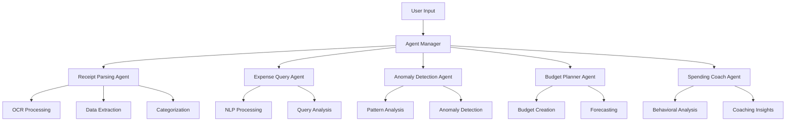

# 🤖 AI Finance Assistant

An intelligent personal finance management system powered by multiple specialized AI agents. Transform your financial management with cutting-edge AI technology that understands receipts, analyzes spending patterns, detects anomalies, plans budgets, and provides personalized coaching.


## ✨ Features

### 🧾 AI Receipt Processing
- **Smart OCR**: Upload receipt images and extract data automatically
- **Multi-Engine Processing**: Uses EasyOCR, Tesseract, and Google Vision API
- **Auto-Categorization**: Intelligently categorizes expenses
- **Confidence Scoring**: Shows accuracy confidence for each extraction
- **Demo Mode**: Try the feature without backend setup

### 💰 Intelligent Expense Tracking
- **Natural Language Queries**: Ask questions about your spending in plain English
- **Real-time Analytics**: Live dashboard with spending insights
- **Category Management**: Smart categorization with custom categories
- **Monthly Salary Automation**: Automatic salary crediting on the 2nd of each month

### 🔍 Anomaly Detection
- **Unusual Spending Detection**: AI identifies suspicious transactions
- **Pattern Analysis**: Learns your spending patterns
- **Real-time Alerts**: Get notified of anomalies immediately
- **Statistical Models**: Uses advanced ML algorithms

### 📊 AI Budget Planning
- **Personalized Budgets**: AI creates budgets based on your spending history
- **Forecasting**: Predict future expenses and income
- **Goal Setting**: Set and track financial goals
- **Optimization**: Get recommendations to improve your budget

### 🎯 Spending Coach
- **Behavioral Analysis**: Understand your spending behavior
- **Personalized Advice**: Get tailored financial recommendations
- **Progress Tracking**: Monitor your financial improvement
- **Motivational Insights**: Stay motivated with positive reinforcement

## 🚀 Quick Start

### Prerequisites
- **Node.js** 16+ and npm
- **Python** 3.8+
- **Git**

### Installation

1. **Clone the repository**
   ```bash
   git clone https://github.com/your-username/Google-Agentic-AI.git
   cd Google-Agentic-AI
   ```

2. **Install dependencies**
   ```bash
   # Backend dependencies
   pip install -r requirements.txt
   
   # Frontend dependencies
   npm install
   ```

3. **Start the application**
   ```bash
   # Start both frontend and backend
   npm run dev:full
   
   # Or start separately:
   # Backend: python start_backend.py
   # Frontend: npm run dev
   ```

4. **Access the application**
   - **Frontend**: http://localhost:3000
   - **Backend API**: http://localhost:8000
   - **API Docs**: http://localhost:8000/docs

## 🏗️ Architecture

### AI Agents System
The application uses 5 specialized AI agents working together:



### Technology Stack

#### Frontend
- **React 18** with TypeScript
- **Tailwind CSS** for styling
- **Framer Motion** for animations
- **React Router** for navigation
- **React Hook Form** for forms
- **Recharts** for data visualization

#### Backend
- **FastAPI** for REST API
- **Python 3.8+** with async/await
- **SQLite/PostgreSQL** for database
- **Firebase** for authentication
- **Multiple OCR engines** for receipt processing

#### AI & ML
- **OpenAI GPT** for natural language processing
- **Google Vision API** for OCR
- **AWS Textract** for document analysis
- **EasyOCR** for text extraction
- **Scikit-learn** for anomaly detection
- **TensorFlow** for deep learning models

## 📱 Screenshots

### Dashboard


### Receipt Scanner


### Expense Analytics


### Budget Planner


## 🔧 Configuration

### Environment Variables (Optional)

Create a `.env` file for enhanced features:

```env
# OpenAI API (for advanced AI features)
OPENAI_API_KEY=your_openai_api_key

# Google Cloud Vision API (for OCR)
GOOGLE_API_KEY=your_google_api_key
GOOGLE_CLOUD_PROJECT=your_project_id

# AWS Textract (for document analysis)
AWS_ACCESS_KEY_ID=your_aws_access_key
AWS_SECRET_ACCESS_KEY=your_aws_secret_key

# Firebase (for authentication)
FIREBASE_PROJECT_ID=your_firebase_project_id
```

**Note**: The application works without API keys using basic functionality and demo mode.

## 🧪 Testing

### Test Receipt Processing
```bash
python test_receipt_processing.py
```

### Run All Tests
```bash
# Backend tests
python -m pytest backend/tests/

# Frontend tests
npm test
```

### Demo Mode
Try the receipt processing feature without backend setup:
1. Navigate to Receipt Scanner page
2. Click "Try Demo Receipt Processing"
3. Explore the AI-powered features

## 📚 Documentation

- **[Setup Guide](SETUP_GUIDE.md)** - Detailed installation and configuration
- **[Receipt Processing](RECEIPT_PROCESSING.md)** - Complete guide to AI receipt processing
- **[API Documentation](http://localhost:8000/docs)** - Interactive API documentation
- **[Architecture Guide](docs/ARCHITECTURE.md)** - System architecture details

## 🤝 Contributing

We welcome contributions! Please see our [Contributing Guide](CONTRIBUTING.md) for details.

### Development Setup
1. Fork the repository
2. Create a feature branch
3. Make your changes
4. Add tests
5. Submit a pull request

### Code Style
- **Frontend**: ESLint + Prettier
- **Backend**: Black + isort
- **Commits**: Conventional Commits

## 🐛 Troubleshooting

### Common Issues

#### Backend Won't Start
```bash
# Check dependencies
pip install -r requirements.txt

# Check Python version
python --version  # Should be 3.8+
```

#### Frontend Build Errors
```bash
# Clear cache and reinstall
rm -rf node_modules package-lock.json
npm install
```

#### Receipt Processing Not Working
- Use demo mode for testing without API keys
- Ensure image files are < 10MB
- Use clear, well-lit receipt images

See the [Setup Guide](SETUP_GUIDE.md) for more troubleshooting tips.

## 📄 License

This project is licensed under the MIT License - see the [LICENSE](LICENSE) file for details.

## 🙏 Acknowledgments

- **OpenAI** for GPT models
- **Google** for Vision API
- **AWS** for Textract
- **Firebase** for authentication
- **React** and **FastAPI** communities

## 🌟 Star History

[](https://star-history.com/#your-username/Google-Agentic-AI&Date)

## 📞 Support

- **Documentation**: Check our comprehensive guides
- **Issues**: Report bugs on GitHub Issues
- **Discussions**: Join GitHub Discussions
- **Email**: support@ai-finance-assistant.com

---

**Made with ❤️ and 🤖 AI**

Transform your financial management with the power of artificial intelligence!